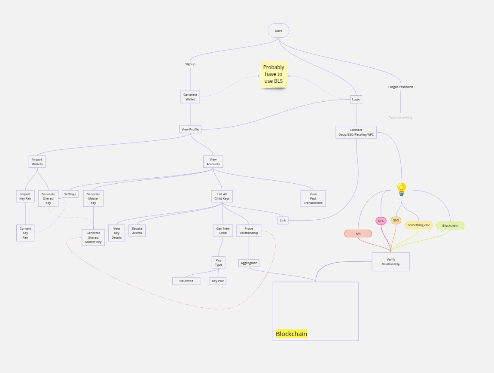

# [WIP] Keyless-Login

## Introduction

This project is a simple implementation of a keyless login system. It is a proof of concept and is not intended to be used in a production environment.
### 1. Start
- **Option A**: Sign Up
- **Option B**: Log In
- **Option C**: Forgot Password / Recovery

---

### 2. Sign Up
1. **Generate or Import Master Key**  
   - [ ] Generate new wallet/key pair  
   - [ ] Import existing key (optional)

2. **Profile Setup**
   - Name, email (optional), etc.
   - Link to newly created/imported key

3. **View Accounts**
   - Lists all child keys (none by default)
   - Option to create or import more keys

---

### 3. Key Management
1. **Generate Shared Key** or **Shared Master Key**  
   - Possibly use BLS or threshold cryptography  
2. **Generate Child Key**  
   - Derive child from master
   - (Optional) “Prove Relationship” to aggregator
3. **Import Wallets / Key Pairs**  
   - Convert or merge external keys
4. **View Key Details / Revoke Access**  
   - Manage permissions or revoke child keys

---

<<<<<<< HEAD
### 4. Login Flow
=======
## 4. Login Flow
>>>>>>> 6a9feaa (chore: flow in readme)
1. **Enter Basic Credentials** (app password, username, or passkey)
2. **Connect** to:
   - DApps (via Web3)  
   - SSO (Google, others)  
   - NFC passkey  
3. **View Past Transactions / Link**
   - Once logged in, see transaction history
   - Option to link new services or blockchains

---

### 5. Verification Flow
1. **Prove Relationship**  
   - Show that a child key belongs to a master key using BLS or zero-knowledge
2. **Transmit Proof**  
   - NFC, API, or SSO channel
3. **Verify Relationship**  
   - On-chain (Blockchain)  
   - Off-chain aggregator (API)  
   - SSO provider

---

### 6. Forgot Password / Recovery
- **Recovery Options**:
  - Use mnemonic or seed phrase
  - Use BLS threshold recovery with trusted parties
- **Reset** or **Regenerate** user credentials, if possible

### Flow
   

### Security Notice

- **Key Exposure**: The example code prints private keys for demonstration. In a real‐world application, never log or expose private keys.  
- **Production Readiness**: This demonstration does not include secure storage, hardware wallet integration, or comprehensive error handling. For a production environment, additional safeguards are required.  
- **Entropy**: When creating a new key (`NewKey()`), the code depends on `crypto.GenerateKey()` from Go’s standard library, which is sufficiently secure for most use cases but should still be handled carefully.

### Contributions and Credits
This project was developed during the [Encode](https://www.encode.club/) Expander Bootcamp (Q1 2025), focusing on [Polyhedra's Expander](https://www.polyhedra.network/expander) proof generation backend. Contributors include (Discord usernames):

- soumyadeep_02 (Roy)
- dgallegos. (Diego)
- raadhhaseeb (Haseeb)

---

### License

All files are provided under the terms of the [MIT License](https://opensource.org/licenses/MIT). See the [LICENSE](LICENSE) file for details. 

---

**Disclaimer:** Use this repository at your own risk. While it may serve as a valuable learning tool, it is not audited or officially supported for handling significant funds or sensitive operations. AI was used to generate portions of the code.